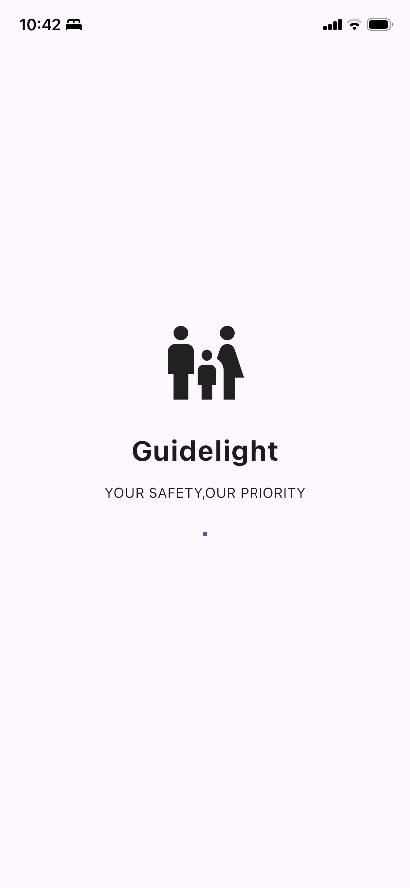
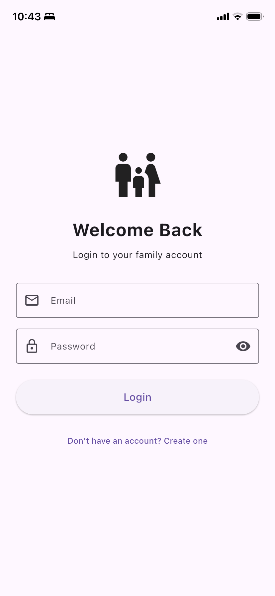
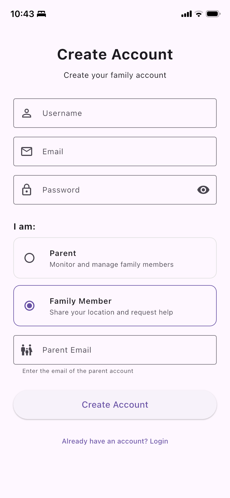
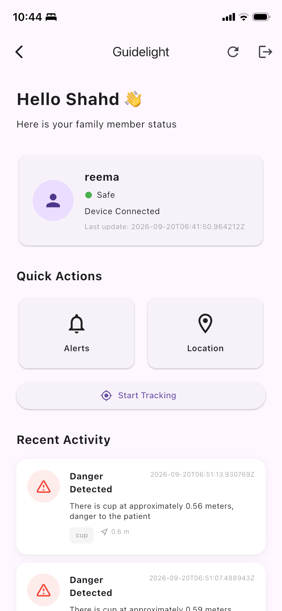
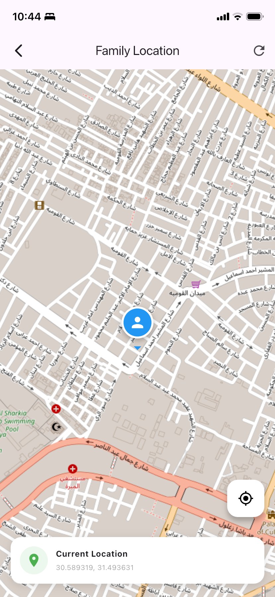
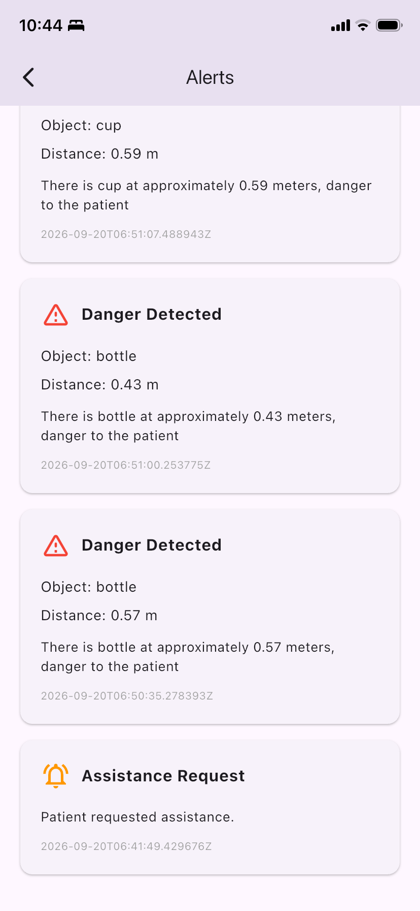
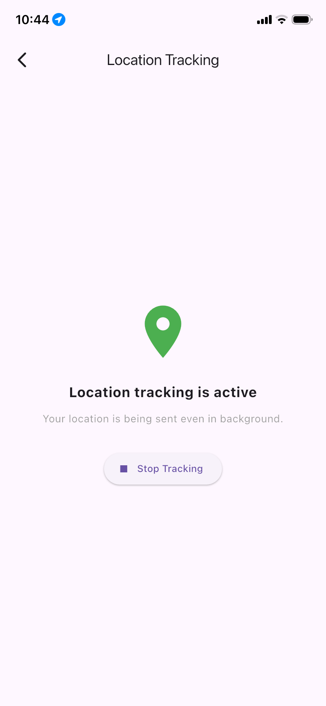

# Guidelight

**Guidelight** is a family safety mobile application designed to help families monitor the safety and location of their loved ones.

The system combines a Flutter mobile application, a Django REST API backend, and a YOLO-based computer vision module to detect potentially dangerous objects and send safety alerts to the connected family account.

## Features

* User registration and JWT authentication
* Family member management
* Family member location tracking
* Safety and danger alerts
* YOLO-based object detection
* OpenCV camera processing
* REST API communication between the detection system, backend, and mobile app
* Activity and safety status monitoring
* Django Admin for managing application data
* Device authentication using a secure API key

## Screenshots

### Login



### Home



### Alerts



### Location



### Family Tracking



### Safety Status



### Application



## System Architecture

```text
┌──────────────────────┐
│   YOLO / OpenCV      │
│  Object Detection    │
└──────────┬───────────┘
           │
           │ Device API
           ▼
┌──────────────────────┐
│   Django REST API    │
│      Backend         │
└──────────┬───────────┘
           │
           │ REST API
           ▼
┌──────────────────────┐
│   Flutter Mobile App │
│                      │
│ • Login / Register   │
│ • Home               │
│ • Alerts             │
│ • Location           │
│ • Family Tracking    │
└──────────────────────┘
```

## Technologies

### Mobile Application

* Flutter
* Dart
* REST API integration
* JWT Authentication

### Backend

* Python
* Django
* Django REST Framework
* Simple JWT
* SQLite

### Computer Vision

* Python
* YOLO
* OpenCV

## How It Works

1. The computer vision module captures frames from a camera.
2. YOLO detects objects in the scene.
3. The system estimates the distance of detected objects.
4. When a potentially dangerous object is detected within the configured safety distance, an alert is created.
5. The alert is sent to the Django REST API.
6. Django stores the alert and associates it with the corresponding family account.
7. The Flutter application retrieves the alert and displays it to the family user.

## Project Structure

```text
guidelight_family/
│
├── lib/                       # Flutter application
│   ├── models/
│   ├── screens/
│   ├── services/
│   └── widgets/
│
├── guidelight_backend/       # Django REST API
│   ├── config/
│   ├── users/
│   └── manage.py
│
├── guidelight_detect/        # YOLO / OpenCV detection
│   ├── main.py
│   ├── calibration.json
│   ├── requirements.txt
│   └── README.md
│
├── android/                  # Android platform
├── ios/                      # iOS platform
├── macos/                    # macOS platform
├── web/                      # Flutter Web
│
├── assets/
│   └── screenshots/          # Application screenshots
│
├── .env.example              # Environment variable template
├── .gitignore
├── pubspec.yaml
└── README.md
```

## Setup

### 1. Clone the Repository

```bash
git clone https://github.com/Shahdhisham230/guidelight.git
cd guidelight
```

### 2. Flutter

Make sure Flutter is installed, then run:

```bash
flutter pub get
```

Run the application with:

```bash
flutter run
```

### 3. Django Backend

Create and activate a virtual environment:

```bash
cd guidelight_backend

python3 -m venv .venv
source .venv/bin/activate
```

Install the backend dependencies:

```bash
pip install django djangorestframework djangorestframework-simplejwt
```

Apply migrations:

```bash
python manage.py migrate
```

Start the server:

```bash
python manage.py runserver
```

### 4. Detection Module

Go to the detection directory:

```bash
cd guidelight_detect
```

Install the required packages:

```bash
pip install -r requirements.txt
```

The device API key should be configured through an environment variable.

> **Security:** Never commit `.env`, Firebase service-account files, API keys, or other private credentials to GitHub.

## Security

Sensitive configuration files are excluded from the repository using `.gitignore`.

Use `.env.example` as a template for required environment variables.

Never publish:

* API keys
* Firebase service-account credentials
* `.env` files
* Database files containing private data
* Private certificates or signing credentials

## Project Status

Guidelight is a functional project combining mobile development, backend development, and computer vision into one integrated system.

The current implementation focuses on family safety monitoring, location tracking, object detection, and in-app safety alerts.

## Developer

**Shahd Hisham**

GitHub:
https://github.com/Shahdhisham230/guidelight

---

If you find this project interesting, feel free to explore the repository.
